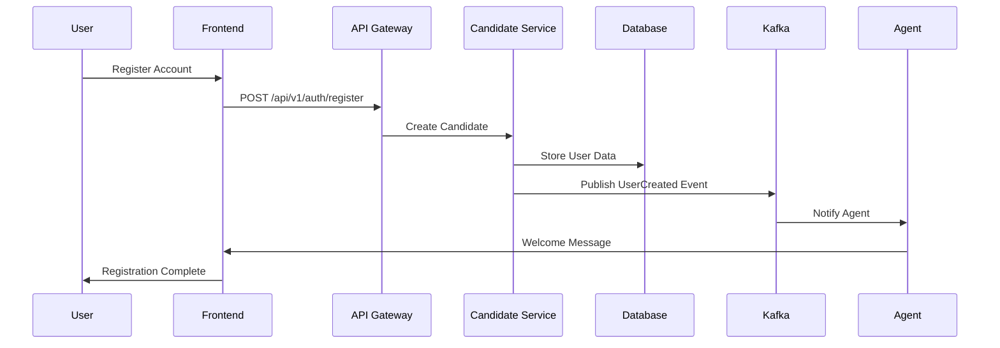
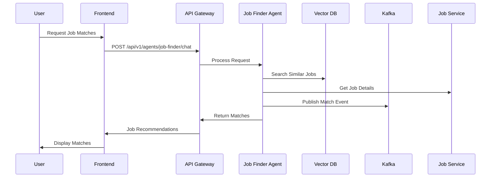

# JobZee System Design Document

## Table of Contents

1. [System Overview](#system-overview)
2. [Architecture Overview](#architecture-overview)
3. [High-Level Design](#high-level-design)
4. [Detailed Component Design](#detailed-component-design)
5. [Data Flow](#data-flow)
6. [Integration Patterns](#integration-patterns)
7. [Scalability & Performance](#scalability--performance)
8. [Security Design](#security-design)
9. [Monitoring & Observability](#monitoring--observability)
10. [Deployment Architecture](#deployment-architecture)

## System Overview

JobZee is a sophisticated AI-powered job matching and recruitment platform that revolutionizes the hiring process through intelligent automation, real-time communication, and advanced matching algorithms.

### Core Objectives

- **Intelligent Job Matching**: AI-powered matching between candidates and job opportunities
- **Automated Recruitment**: Streamlined hiring process with AI agents
- **Real-time Communication**: Seamless interaction between users and AI agents
- **Scalable Architecture**: Microservices-based design for high availability
- **Data-Driven Insights**: Comprehensive analytics and reporting

### Key Stakeholders

- **Candidates**: Job seekers looking for opportunities
- **HR Professionals**: Recruiters and hiring managers
- **AI Agents**: Autonomous agents handling matching and communication
- **System Administrators**: Platform operators and maintainers

## Architecture Overview

### System Architecture Diagram

```
┌─────────────────────────────────────────────────────────────────────────────┐
│                                JOBZEE PLATFORM                              │
├─────────────────────────────────────────────────────────────────────────────┤
│                                                                             │
│  ┌─────────────────┐    ┌─────────────────┐    ┌─────────────────┐         │
│  │   Frontend      │    │   Backend       │    │   Agents        │         │
│  │   (Next.js)     │◄──►│   (Go/Gin)      │◄──►│   (Python)      │         │
│  │   - React       │    │   - Microservices│   │   - LangChain   │         │
│  │   - TypeScript  │    │   - gRPC        │   │   - LangGraph   │         │
│  │   - Tailwind    │    │   - REST API    │   │   - OpenAI      │         │
│  └─────────────────┘    └─────────────────┘    └─────────────────┘         │
│           │                       │                       │                 │
│           │                       │                       │                 │
│           ▼                       ▼                       ▼                 │
│  ┌─────────────────┐    ┌─────────────────┐    ┌─────────────────┐         │
│  │   PostgreSQL    │    │   Redis         │    │   Qdrant        │         │
│  │   (Database)    │    │   (Cache)       │    │   (Vector DB)   │         │
│  │   - User Data   │    │   - Sessions    │   │   - Embeddings  │         │
│  │   - Job Data    │    │   - Rate Limiting│   │   - Similarity  │         │
│  │   - Applications│    │   - Caching     │   │   - Search      │         │
│  └─────────────────┘    └─────────────────┘    └─────────────────┘         │
│           │                       │                       │                 │
│           │                       │                       │                 │
│           ▼                       ▼                       ▼                 │
│  ┌─────────────────┐    ┌─────────────────┐    ┌─────────────────┐         │
│  │   Kafka         │    │   MinIO         │    │   MCP Tools     │         │
│  │   (Message Q)   │    │   (Object Store)│    │   (Agent Tools) │         │
│  │   - Events      │    │   - Files       │   │   - GitHub API  │         │
│  │   - Notifications│   │   - Documents   │   │   - Email       │         │
│  │   - Workflows   │    │   - Media       │   │   - Calendar    │         │
│  └─────────────────┘    └─────────────────┘    └─────────────────┘         │
│                                                                             │
└─────────────────────────────────────────────────────────────────────────────┘
```

### Technology Stack

#### Frontend Layer

- **Framework**: Next.js 14 with App Router
- **Language**: TypeScript
- **Styling**: Tailwind CSS
- **State Management**: React Hooks + Context
- **Internationalization**: i18next
- **Real-time**: WebSocket connections

#### Backend Layer

- **Language**: Go 1.21+
- **Framework**: Gin (HTTP) + gRPC
- **Architecture**: Microservices
- **Authentication**: JWT + Refresh Tokens
- **Validation**: Custom validators
- **Logging**: Structured logging

#### AI Agents Layer

- **Language**: Python 3.9+
- **Framework**: LangChain + LangGraph
- **LLM**: OpenAI GPT-4
- **Vector Database**: Qdrant
- **Workflows**: LangGraph state machines
- **Tools**: MCP (Model Context Protocol)

#### Data Layer

- **Primary Database**: PostgreSQL 15
- **Cache**: Redis 7
- **Vector Database**: Qdrant
- **Object Storage**: MinIO
- **Message Queue**: Apache Kafka

#### Infrastructure

- **Containerization**: Docker
- **Orchestration**: Kubernetes
- **Monitoring**: Prometheus + Grafana
- **CI/CD**: Jenkins
- **IaC**: Terraform

## High-Level Design

### Microservices Architecture

The system follows a microservices architecture with the following services:

1. **API Gateway Service** (`api-service`)

   - Entry point for all client requests
   - Authentication and authorization
   - Rate limiting and request routing
   - API versioning

2. **Job Service** (`job-service`)

   - Job CRUD operations
   - Job search and filtering
   - Job analytics and metrics

3. **Candidate Service** (`candidate-service`)

   - Candidate profile management
   - Resume parsing and analysis
   - Portfolio integration

4. **Agent Service** (`agent-service`)

   - Agent coordination and management
   - Agent-to-agent communication
   - Agent state management

5. **Job Finder Agent** (`job-finder-agent`)

   - Candidate job matching
   - Profile analysis and recommendations
   - Interview coordination

6. **Candidate Finder Agent** (`candidate-finder-agent`)
   - Job candidate matching
   - Candidate sourcing and analysis
   - Recruitment workflow automation

### Communication Patterns

#### Synchronous Communication

- **REST APIs**: Client-server communication
- **gRPC**: Inter-service communication
- **WebSockets**: Real-time bidirectional communication

#### Asynchronous Communication

- **Kafka**: Event-driven architecture
- **Message Queues**: Reliable message delivery
- **Event Sourcing**: State changes and audit trails

## Data Flow

### User Registration Flow



### Job Matching Flow



## Integration Patterns

### Service-to-Service Communication

#### gRPC Communication

- **Protocol**: Protocol Buffers
- **Transport**: HTTP/2
- **Features**: Bidirectional streaming, compression
- **Use Cases**: High-performance inter-service communication

#### REST API Communication

- **Protocol**: HTTP/1.1
- **Format**: JSON
- **Features**: Stateless, cacheable
- **Use Cases**: External API integration, webhooks

### Event-Driven Architecture

#### Kafka Topics

- `user-events`: User registration, profile updates
- `job-events`: Job creation, updates, applications
- `match-events`: Job-candidate matches
- `interview-events`: Interview scheduling, updates
- `agent-events`: Agent interactions, workflows

#### Event Schema

```json
{
  "event_id": "uuid",
  "event_type": "user.created",
  "timestamp": "2024-01-01T00:00:00Z",
  "version": "1.0",
  "data": {
    "user_id": "uuid",
    "email": "user@example.com",
    "profile_type": "candidate"
  },
  "metadata": {
    "source": "api-gateway",
    "correlation_id": "uuid"
  }
}
```

## Scalability & Performance

### Horizontal Scaling

#### Stateless Services

- **API Gateway**: Load balanced across multiple instances
- **Backend Services**: Auto-scaling based on CPU/memory
- **Frontend**: CDN distribution, edge caching

#### Stateful Services

- **Database**: Read replicas, connection pooling
- **Cache**: Redis cluster, sharding
- **Message Queue**: Kafka cluster, partitioning

### Performance Optimization

#### Caching Strategy

- **Application Cache**: Redis for session data
- **CDN Cache**: Static assets, API responses
- **Database Cache**: Query result caching
- **Vector Cache**: Embedding similarity cache

#### Database Optimization

- **Indexing**: Composite indexes for common queries
- **Partitioning**: Time-based partitioning for large tables
- **Connection Pooling**: Efficient connection management
- **Query Optimization**: Prepared statements, query analysis

## Security Design

### Authentication & Authorization

#### JWT-Based Authentication

- **Access Tokens**: Short-lived (24 hours)
- **Refresh Tokens**: Long-lived (7 days)
- **Token Rotation**: Automatic refresh token rotation
- **Token Revocation**: Blacklist for compromised tokens

#### Role-Based Access Control (RBAC)

- **Roles**: Candidate, HR Professional, Admin
- **Permissions**: Resource-level permissions
- **Dynamic Permissions**: Context-aware access control

### Data Security

#### Encryption

- **Data at Rest**: AES-256 encryption
- **Data in Transit**: TLS 1.3
- **API Keys**: Encrypted storage
- **Passwords**: bcrypt hashing (cost 12)

#### Privacy & Compliance

- **GDPR Compliance**: Data minimization, right to deletion
- **Data Retention**: Configurable retention policies
- **Audit Logging**: Complete audit trail
- **Data Masking**: PII protection in logs

## Monitoring & Observability

### Metrics Collection

#### Application Metrics

- **Response Times**: P50, P95, P99 latencies
- **Throughput**: Requests per second
- **Error Rates**: 4xx, 5xx error percentages
- **Business Metrics**: Job matches, user engagement

#### Infrastructure Metrics

- **CPU Usage**: Per-service CPU utilization
- **Memory Usage**: Memory consumption patterns
- **Disk I/O**: Database and storage performance
- **Network I/O**: Bandwidth utilization

### Logging Strategy

#### Structured Logging

- **Format**: JSON structured logs
- **Fields**: Timestamp, level, service, correlation_id
- **Context**: Request context, user information
- **Sampling**: Configurable log sampling

#### Log Aggregation

- **Centralized Logging**: ELK stack or similar
- **Log Retention**: Configurable retention periods
- **Log Search**: Full-text search capabilities
- **Alerting**: Log-based alerting rules

## Deployment Architecture

### Container Orchestration

#### Kubernetes Deployment

- **Namespaces**: Environment isolation
- **Deployments**: Rolling updates, rollback capability
- **Services**: Load balancing, service discovery
- **ConfigMaps/Secrets**: Configuration management

#### Service Mesh

- **Istio**: Traffic management, security, observability
- **Sidecar Injection**: Automatic proxy injection
- **Traffic Splitting**: Canary deployments
- **Circuit Breaking**: Failure isolation

### Infrastructure as Code

#### Terraform Configuration

- **Resource Management**: Cloud resource provisioning
- **State Management**: Centralized state storage
- **Module Reusability**: Reusable infrastructure modules
- **Environment Parity**: Consistent environments

#### Helm Charts

- **Application Packaging**: Kubernetes application packaging
- **Configuration Management**: Environment-specific values
- **Dependency Management**: Chart dependencies
- **Version Management**: Chart versioning

---

## Conclusion

This system design document provides a comprehensive overview of the JobZee platform architecture. The design emphasizes:

- **Scalability**: Microservices architecture with horizontal scaling
- **Reliability**: Fault tolerance and disaster recovery
- **Security**: Multi-layered security approach
- **Observability**: Comprehensive monitoring and tracing
- **Maintainability**: Clear separation of concerns and modular design

The system is designed to handle high-scale job matching operations while maintaining high availability, security, and performance standards expected in a production environment.
